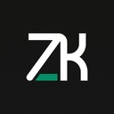
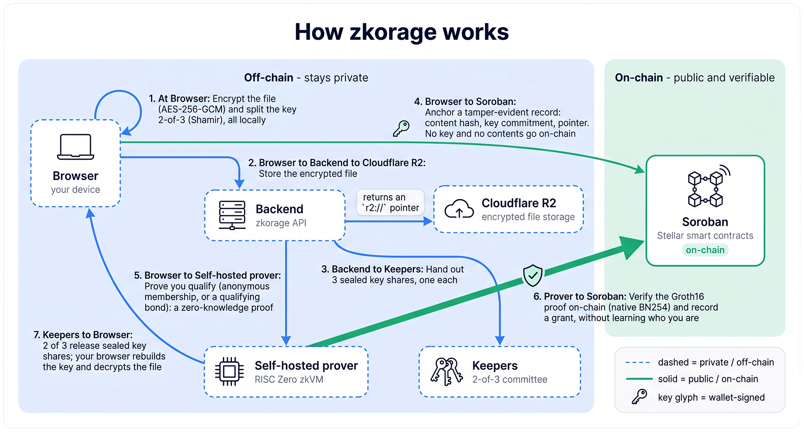

<p align="center">
  <picture>
    <source media="(prefers-color-scheme: dark)" srcset="frontend/public/brand/zkorage-mark-light.jpg">
    
  </picture>
</p>

<h1 align="center">zkorage</h1>

<p align="center"><b>Prove a fact about private data. Let anyone verify it on Stellar without seeing the data.</b></p>

<p align="center">
  
  
  
</p>

<p align="center">
  <a href="https://zkorage.wazowsky.id"><b>Live demo</b></a>
</p>

<p align="center">
  <a href="#what-you-can-do">What it does</a> &nbsp;·&nbsp;
  <a href="#how-it-works">How it works</a> &nbsp;·&nbsp;
  <a href="#what-the-proof-guarantees-and-the-trust-model">Trust model</a> &nbsp;·&nbsp;
  <a href="#verify-it-yourself">Verify it yourself</a> &nbsp;·&nbsp;
  <a href="#deployed-contracts-testnet">Contracts</a> &nbsp;·&nbsp;
  <a href="#tests-and-rigor">Tests</a> &nbsp;·&nbsp;
  <a href="#run-it-locally">Run it locally</a> &nbsp;·&nbsp;
  <a href="ARCHITECTURE.md">Architecture</a>
</p>

zkorage is a zero-knowledge toolkit on Stellar (Soroban). You hold private data: a document, a reserve
balance, a bond you locked. You prove **one fact** about it to someone who should not see the rest, and that
person verifies the proof against an on-chain contract. They never see your data, and they do not have to
trust our server. Everything reads back from the public ledger.

You can browse and verify everything with **no wallet**. Connect Freighter (set to Testnet) only when you want
to create your own proofs and pay your own gas.

> Built for **Stellar Hacks: Real-World ZK**. The contracts are **unaudited**. This is a **testnet demo**. Do
> not use it with real funds.

## What you can do

The app has two areas.

### Confidential Data Room

Store an encrypted document and open it only to people who prove they are allowed, without revealing who they
are. The file stays encrypted off-chain; only a tamper-evident fingerprint goes on-chain. The room owner picks
one access model:

- **Membership.** The owner approves a list. A member opens a document by proving membership without revealing
  which member, and only once per room (a nullifier blocks reuse).
- **Bonded Access.** The owner sets a requirement (a token, a minimum amount, a deadline). Anyone who locks a
  qualifying bond opens the room with no approval and no member list, proving they qualify without revealing
  which wallet, which lock, or the exact amount.

When access is granted, the document key is released by a **2-of-3 keeper committee**, so no single server ever
holds the key. The reader collects two sealed shares and rebuilds the key in their own browser.

### Bonded Proofs

Lock tokens in a time-locked escrow contract, then build proofs on top of that lock. The standalone Bonded
Access bond doubles as a reusable, anonymous access gate across rooms with the same requirement. Two earlier
proof demos (a solvency proof that voids the moment you withdraw collateral, and an anonymous tier that expires
at a deadline) stay reachable by URL.

Outside the app, the public site has Documentation, a **Verify** page (paste a link or id and re-check it
on-chain), an **Explorer** of public rooms, and a **Faucet** for the four test tokens used by Bonded Access.

## What the proof guarantees, and the trust model

1. **The verifier learns one fact and nothing else.** The proof attests the predicate ("reader holds a
   qualifying bond", "reader is an approved member"), not the underlying data.
2. **The prover is the only party that ever sees the private data, so we self-host proving** and never send a
   private witness to a shared proving market.
3. **The result lives on-chain.** Anyone re-reads it and re-verifies the proof against the public Groth16
   verifier, with no zkorage server. See [Verify it yourself](#verify-it-yourself).
4. **Every claim is anchored to something real.** For the Data Room and Bonded Access, the anchor is on-chain
   fact: a lock's state, a token's supply, checked by the gate contract. Where a claim is about issuer-signed
   data, that signature is checked **inside** the zkVM. A proof over unanchored data would be hollow, so the
   anchor is part of the design.

## How it works

<p align="center">
  <picture>
    <source media="(prefers-color-scheme: dark)" srcset="frontend/public/diagrams/zkorage-architecture-dark.png">
    
  </picture>
</p>

- **Prover (off-chain, self-hosted).** A RISC Zero zkVM guest checks the private input, asserts the fact, and
  produces a STARK proof. The host wraps that into a small Groth16 proof over the BN254 curve. It runs on a
  box we control, with GPU proving and a CPU fallback, never in the browser and never on a shared market.
- **Verifier (on-chain).** A bare Groth16 verifier on Soroban checks the proof with native BN254 host
  functions. A small policy/gate contract then binds the proven fact to on-chain facts and records the result,
  so anyone can re-read and re-check it.
- **Keys (Data Room).** The document key is AES-256-GCM, split 2-of-3 with Shamir across a keeper committee.
  No key or contents ever go on-chain.

**Built with:** Stellar / Soroban (soroban-sdk 26.1.0, Protocol 26 BN254 host functions), RISC Zero 5.0.0-rc.1
(zkVM + Groth16 wrap, BN254), Rust, TypeScript, React + Vite, Node. Full design notes in
[`ARCHITECTURE.md`](ARCHITECTURE.md).

## Verify it yourself

Every result is on the public chain, so you can re-check it with the `stellar` CLI and no zkorage server. The
in-app **Verify** page fills in the exact values for any claim, so you do not have to assemble them by hand.

```bash
# Re-verify a Groth16 proof against the public verifier (bundle comes from the Verify page or GET /audit/latest):
stellar contract invoke --id CBAPC663PTWIWDLYNCG5WAD5MIZF4SKY43U6L2NM5ZUU5XFOS4JDYAFW \
  --network testnet --source <any-funded-account> -- verify --seal <hex> --image_id <hex> --journal <hex>
```

Here `journal` is the sha256 digest of the journal bytes.

## Deployed contracts (testnet)

These are the contracts the live app uses. The full record is in
[`contract/deployment.testnet.json`](contract/deployment.testnet.json) and [`ARCHITECTURE.md`](ARCHITECTURE.md),
and the in-app **Contracts** page reads them live. Click an id to open it on stellar.expert.

| Contract | Role | Id |
|---|---|---|
| Groth16 verifier | Checks every proof on-chain (RISC Zero params 5.0.0-rc.1) | [`CBAPC663…AFW`](https://stellar.expert/explorer/testnet/contract/CBAPC663PTWIWDLYNCG5WAD5MIZF4SKY43U6L2NM5ZUU5XFOS4JDYAFW) |
| Data Room | Seals documents, gates anonymous access, records grants | [`CDUQITRV…LNN`](https://stellar.expert/explorer/testnet/contract/CDUQITRVJOPJNVWBUINLZFI2LHPOLVFW2I7354WEFDG2W3VIG627HLNN) |
| Escrow | Time-locked bond the proofs bind to | [`CAMQKJKA…OXC`](https://stellar.expert/explorer/testnet/contract/CAMQKJKAJTOMT66N5N3E3VIRTN5ACDKV6P3Z2HLYVJHLAVRGJKHZFOXC) |
| Bonded Access gate | Verifies the anonymous bond proof and grants access | [`CCKX6B7Q…CZU`](https://stellar.expert/explorer/testnet/contract/CCKX6B7QIE42YA27Y4KTB6CTXRB3OBGR5EW7N2BLAG4AB3V6CFDKXCZU) |

## Tests and rigor

The on-chain behavior is covered by Rust unit tests on every contract, plus end-to-end runs that prove and
submit against live testnet, plus Playwright specs that drive a real browser.

| Contract | Tests |
|---|---|
| Data Room | 117 |
| Bonded Access gate | 36 |
| Solvency gate | 29 |
| Tier gate | 25 |
| Escrow | 22 |
| Demo token | 7 |
| Groth16 verifier | 4 |

The strongest evidence is on-chain, not a test count:

- **Anonymous access, then reuse blocked.** Two different accessors derived from one membership credential: the
  first opened the room, the second was rejected on-chain by the nullifier, and the record reveals neither
  identity nor which member. This is the load-bearing demonstration, and it is live.
- **A proof that voids itself.** In the solvency demo, a proof verified SOLVENT on-chain, and the moment the
  collateral was unbonded the same `is_granted` read returned VOID. The bond is the live signal, not a stored
  flag.

Run the suites yourself in [Run it locally](#run-it-locally).

## Run it locally

You need **Node 22**. These steps run the web app against the live testnet contracts, so you do **not** need
the prover or Docker just to browse, read, or verify. Run each server in its own terminal.

```bash
# 1) Build the SDK first. The backend and frontend consume it via file:../sdk.
cd sdk && npm install && npm run build

# 2) Backend API on :8787
cd backend && cp .env.example .env && npm install && npm run dev

# 3) Frontend on :5173
cd frontend && npm install && npm run dev
```

Open http://localhost:5173. The contract ids are already filled in `backend/.env.example`. To submit through
the server relay, set `SIGNER_SECRET` to a funded testnet key; reads and verification work without it.
Cloudflare R2 is optional (leave the `R2_*` vars blank to use the local blob store).

Self-test:

```bash
cd sdk && npm run smoke                 # re-verify the live testnet claims from the chain
cd frontend && npx playwright install   # first run only
npx playwright test                     # end-to-end specs (Chrome runs GPU-disabled; keep it that way)
```

Running the **self-hosted prover** (only needed to create new proofs) and **rebuilding or redeploying the
contracts** are covered in [`prover/README.md`](prover/README.md), [`deploy/README.md`](deploy/README.md), and
[`ARCHITECTURE.md`](ARCHITECTURE.md).

## Repository layout

```
contract/   Soroban contracts (Rust): the bare Groth16 verifier, a demo SEP-41 token, and the policy/gate
            contracts (Data Room, escrow, bond gate, and the earlier per-use-case gates).
prover/     RISC Zero zkVM guests + host. Builds and runs on an x86 + Docker box, not on Windows.
backend/    Node/TypeScript API: mock attester, prover proxy, on-chain verify/submit, and the REST surface.
frontend/   Vite + React + TypeScript (Tailwind + shadcn). Public site (/) plus the sidebar app (/app/*).
sdk/        zkorage-sdk: a read-only TypeScript SDK to query and re-verify claims straight from the chain.
mcp/        zkorage-mcp: a read-only MCP server that exposes the SDK as agent tools. No key custody.
keyper/     The 2-of-3 keeper committee that splits and releases each Data Room document key.
deploy/     Dockerfiles and deploy notes for the prover VM.
```

## Wallet support

zkorage derives your keys by having your wallet sign one fixed message the SEP-53 way (a sha256 over the
standard "Stellar Signed Message" prefix, signed with ed25519, returning the same bytes every time), then
running that signature through a key-derivation step. Nothing is stored, so you get the same keys on any
device.

- **Freighter (tested).** The only wallet wired in today. Install the extension, set it to Testnet, connect
  from the top right.
- **xBull (not integrated yet).** It signs the same SEP-53 way, so it would derive the same identity, but it is
  not wired in. Support is planned through the Stellar Wallets Kit.

Reading and verifying need no wallet. You only need one to create your own proofs and pay your own gas.

## Known limitations and what is next

This is a hackathon demo, and the honest edges are part of the trust story.

- **Unaudited, testnet only.** Do not use the contracts with real funds.
- **The attester is mocked.** Where a claim relies on an issuer's signature, the signer is a demo key,
  swappable for a real issuer. The Data Room and Bonded Access anchor to on-chain fact instead, which is why
  they are the live focus.
- **The demo backend builds witnesses.** Anonymity holds against the prover only when the data owner holds the
  witness, which is the production model. The demo builds witnesses for you so the flow is easy to try.
- **One earlier solvency demo lock has expired**, so that one demo reads void on the live site. The Data Room
  and Bonded Access flows are the working focus.

## License

[MIT](LICENSE).
